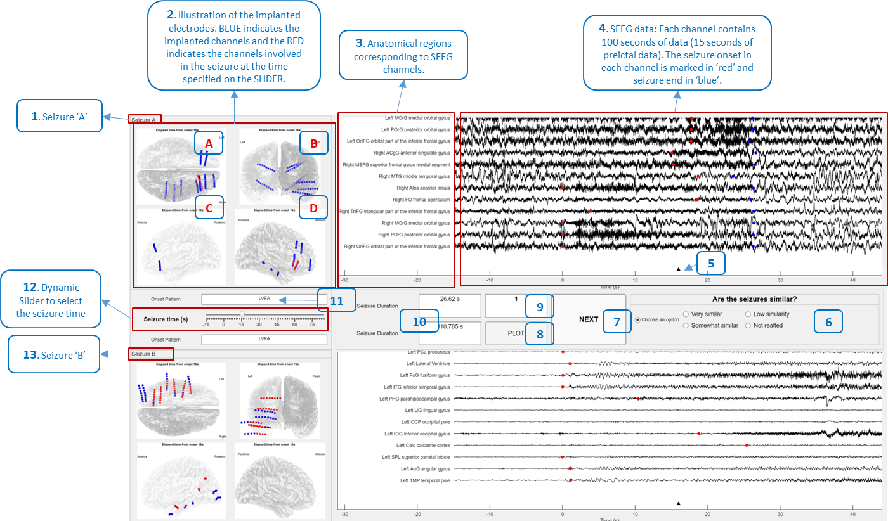

# Graphical User Interface

The following are the details of the different options and illustrations:

## 1 and 13. Seizure name: 
This is an identifier for seizures. In the interface, we illustrate two seizures, Seizure A and Seizure B, for comparison.
## 2. Implanted electrodes: 
This figure illustrates an axial view (A), coronal view (B), sagittal left view (C), and sagittal right view (D) of the implanted electrodes. The BLUE spheres indicate the implanted channels, and the RED spheres indicate the channels involved in the seizure at the time specified on the SLIDER (12).
## 3. Anatomical region list: 
We illustrate the anatomical regions that correspond to each SEEG channel.
## 4. SEEG data: 
We illustrate 100 seconds of SEEG data (15 s preceding the onset of the seizure and 85 s succeeding the onset of the seizure) as assessed by experts. The SEEG shown in the figure is filtered between 0.3-100 Hz along with a notch filter to remove the powerline interference. The RED marker indicates the onset of the seizure in each channel, and the BLUE marker indicates the end of the seizure. The illustration shows the first ten regions and SEEG segments involved in the seizure. There is an additional option to zoom in and out of the plot to see the SEEG patterns and the rest of the brain regions involved in the seizure.
## 5. Time marker: 
This marker corresponds to the seizure time specified on the SLIDER (12).
## 6. Similarity options: 
Here, you express your opinion regarding the similarity of the two seizures. You will have four choices: ‘Very similar’, Somewhat similar’, ‘Low similarity’, and ‘Not related’.
## 7. NEXT Button: 
This button navigates forward to evaluate the next pair of seizures. Please note that you need to choose a valid similarity option from (6) in order to enable the NEXT button.
## 8. PLOT Button: 
This button loads the different illustrations in the interface.
## 9. Seizure pair number: 
This number is an indicator of the seizure pair being compared. This is used to save the results later.
## 10. Seizure duration: 
This field indicates the total duration of the seizures in seconds.
## 11. Seizure onset pattern:
This field indicates the seizure onset pattern that was determined visually by the expert. This categorization is performed according to the classification prescribed by Perucca et al. in 2014.
## 12. Slider:
This slider is used to specify the time progression of a seizure.

# Graphical User Interface

The code is available in `GUI.zip`. Follow these steps to evaluate the GUI using artificially generated test patient data 'P1_1':

1. Unzip the folder `GUI`.
2. Use MATLAB 2022b or above to run the following code.
3. The folder contains 6 files/folders:
   - **Data clips**: Contains seizure segments. This file is a `76x5` MATLAB cell file where each column represents:
     - `c1`: Bipolar channel name
     - `c2`: Annotated start of seizure in the channel
     - `c3`: Annotated end of seizure in the channel
     - `c4`: Anatomical location using MICCAI atlas
     - `c5`: SEEG data segment
   - **Slides Images**: Images for each second of bipolar electrode implantations showing how the seizure spreads.
   - **Annotator_1.xlsx**: Contains a list of seizure pairs being compared.
   - **feature_set.mat**: Contains the database of seizure segment information with 4 columns:
     - `c1`: ID of seizure
     - `c2`: Onset region of seizure
     - `c3`: Seizure duration
     - `c4`: Seizure onset pattern number
   - **GUI.m**: The main code to run for the GUI.
   - **onset_lib.mat**: Contains the names of seizure onset patterns corresponding to the numbers in column 4 of the segment information.
4. Open GUI.m and enjoy using the GUI.
---

### Credits

Thomas, J., Abdallah, C., Jaber, K., Aron, O., Dolezalov, I., Gnatkovsky, V., Mansilla, D., Nevalainen, P., Pana, R., Schuele, S. and Singh, J., 2024. Development of a Seizure Matching System for Clinical Decision Making in Epilepsy Surgery. medRxiv, pp.2024-01.

### Research License
This repository is licensed under a research license. The code and resources provided are intended for academic and research purposes only. For any commercial or non-academic use, please contact the respective authors.

### Disclaimer
Please note that the authors of this repository take no responsibility for any consequences or damages arising from the use of this code. Users are advised to use it at their own risk and to thoroughly evaluate its suitability for their specific purposes.

